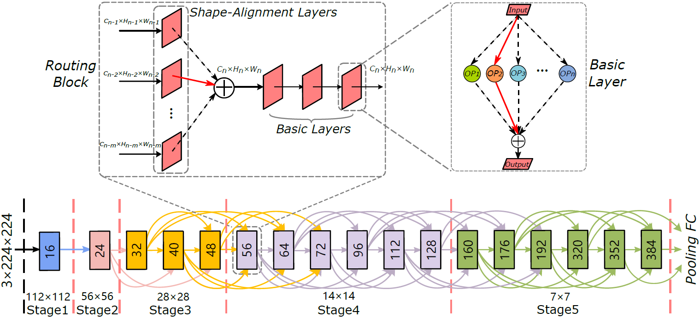
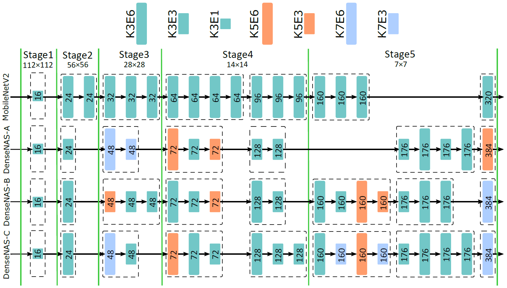

# DenseNAS

The code of the CVPR2020 paper [Densely Connected Search Space for More Flexible Neural Architecture Search](https://arxiv.org/abs/1906.09607)

Neural architecture search (NAS) has dramatically advanced the development of neural network design. We revisit the search space design in most previous NAS methods and find the number of blocks and the widths of blocks are set manually. However, block counts and block widths determine the network scale (depth and width) and make a great influence on both the accuracy and the model cost (FLOPs/latency).

We propose to search block counts and block widths by designing a densely connected search space, i.e., DenseNAS. The new search space is represented as a dense super network, which is built upon our designed routing blocks. In the super network, routing blocks are densely connected and we search for the best path between them to derive the final architecture. We further propose a chained cost estimation algorithm to approximate the model cost during the search. Both the accuracy and model cost are optimized in DenseNAS.

## Requirements

* pytorch 1.0.1
* python 3.6+

## Results

For experiments on the MobileNetV2-based search space, DenseNAS achieves 75.3\% top-1 accuracy on ImageNet with only 361MB FLOPs and 17.9ms latency on a single TITAN-XP. The larger model searched by DenseNAS achieves 76.1\% accuracy with only 479M FLOPs. DenseNAS further promotes the ImageNet classification accuracies of ResNet-18, -34 and -50-B by 1.5\%, 0.5\% and 0.3\% with 200M, 600M and 680M FLOPs reduction respectively.

The comparison of model performance on ImageNet under the MobileNetV2-based search spaces.

The comparison of model performance on ImageNet under the ResNet-based search spaces.

Our pre-trained models can be downloaded in the following links. The complete list of the models can be found in [DenseNAS_modelzoo](https://drive.google.com/open?id=183oIMF6IowZrj81kenVBkQoIMlip9kLo).

| Model                | FLOPs | Latency | Top-1(%)| 
|----------------------|-------|---------|---------| 
| [DenseNAS-Large](https://drive.google.com/open?id=14Zgc-IlxjaRtGyDHJSdMpLHVvOd0Km1u) | 479M  | 28.9ms  | 76.1    | 
| [DenseNAS-A](https://drive.google.com/open?id=1ZdephrAY4GVRqv9SvOXoJDUmO-kWhhml) | 251M  | 13.6ms  | 73.1    | 
| [DenseNAS-B](https://drive.google.com/open?id=1djhL5P1vsWVqWuT5lR7UCxEhw4cET__7) | 314M  | 15.4ms  | 74.6    | 
| [DenseNAS-C](https://drive.google.com/open?id=1L2mqir89b1UiBkePmrtjG6QLi9MqzRdQ) | 361M  | 17.9ms  | 75.3    | 
| [DenseNAS-R1](https://drive.google.com/open?id=1YaMWb1LKpgSS5mgBcB3CthTGtTIOtxWw) | 1.61B | 12.0ms  | 73.5    | 
| [DenseNAS-R2](https://drive.google.com/open?id=1Qawst3E2hqdam2TiTFo2BhBXS-M6AWdh) | 3.06B | 22.2ms  | 75.8    | 
| [DenseNAS-R3](https://drive.google.com/open?id=14RwIGWsurNvevhxL9AcnlngU0KR8WeX-) | 3.41B | 41.7ms  | 78.0    | 

## Train

1. (Optional) We pack the ImageNet data as the lmdb file for faster IO. The lmdb files can be made as follows. If you don't want to use lmdb data, just set `__C.data.train_data_type='img'` in the training config file `imagenet_train_cfg.py`.

    1). Generate the list of the image data. 
    `python dataset/mk_img_list.py --image_path 'the path of your image data' --output_path 'the path to output the lmdb file'`

    2). Use the image list obtained above to make the lmdb file. 
    `python dataset/img2lmdb.py --image_path 'the path of your image data' --list_path 'the path of your image list' --output_path 'the path to output the lmdb file' --split 'split folder (train/val)'`

2. Train the model with the following script. You can also train your customized model by redefine `model` in `retrain.py`. 
`python -m run_apis.retrain --data_path 'The path of ImageNet data' --load_path 'The path you put the net_config of the model'`

## Evaluate

1. Download the related files of the pretrained model and put `net_config` and `weights.pt` into the `model_path`
2. `python -m run_apis.validation --data_path 'The path of ImageNet data' --load_path 'The path you put the pre-trained model'`
